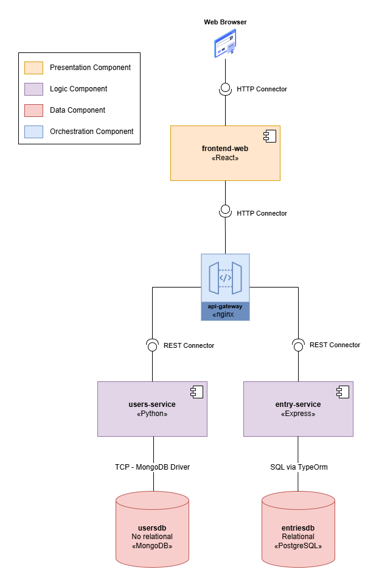
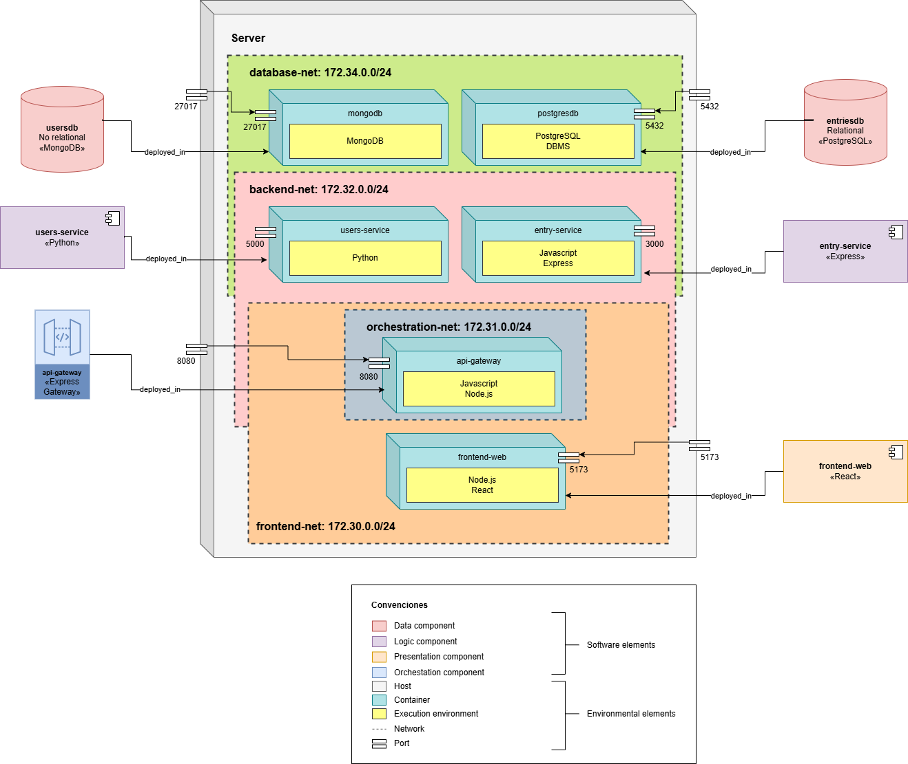

<p align="center">

</p>
<h2 align="center"><big>Laboratory 5</big></br>Security</br>Team 2B<br></br></h2>

# Team

- Samuel Josué Vargas Castro
- Daniel Felipe Soracipa
- Juan Esteban Cárdenas Huertas
- Juan David Ardila Diaz
- Martin Moreno Jara
- Juan José Medina Guerrero
- Sergio Enrique Vargas Pedraza

---

# Laboratory 5 - Security

## Network segmentation pattern

The Network Segmentation Pattern is an architectural tactic for Limit Access (a
form of Attack Resistance). It involves partitioning a network into distinct,
isolated logical subnets, specifically separating Public (Internet-facing, uses
public IPs) and Private (sensitive resources, uses private IPs) areas.

Its core purpose is to strictly control traffic flow between these segments and
prevent the lateral spread of a security compromise. By isolating critical
assets in the Private Subnet, the pattern minimizes their exposure to untrusted
networks like the Internet, ensuring only inspected and authorized traffic can
reach them.

### Quality scenario addressed

The Network Segmentation Pattern primarily addresses Confidentiality and
Integrity, and contributes significantly to Availability.

**Confidentiality**

It shields sensitive data and internal systems (located in the Private Subnet)
from unauthorized disclosure by blocking direct access from external or
less-trusted network segments.

**Integrity**

By controlling the traffic flow, it prevents unauthorized modification or
deletion of data by restricting what an attacker can do even if they compromise
a public-facing segment.

**Availability (Contribution)**

It limits the blast radius of an attack or failure. By containing a security
incident within a specific network segment, the pattern ensures that critical
services in other segments remain operational and available to users.

## Example implementation

### Components & Connectors (C&C) View

**Note:** The components-and-connectors view does not represent the implemented pattern itself; it is presented solely to provide a complete understanding of the components involved in the scenario and how they interact with each other. Additionally, it gives context to the deployment view, where the implementation of the pattern is actually evident.



### Deployment View



### Description of the example scenario

This example implements a **microservices-based web application** that
demonstrates the Network Segmentation Pattern through a multi-tier architecture
handling user authentication and entry management. The system is designed to
protect sensitive data and prevent unauthorized access through strategic network
isolation.

#### System Components

The application consists of six containerized components organized across four
isolated network segments:

**Presentation Tier:**

- **Frontend Web Application** (React/Vite): A single-page application serving
  as the user interface, running on port 5173

**Gateway Tier:**

- **API Gateway** (NGINX): Acts as the reverse proxy and single entry point for
  all API requests, exposed on port 8080

**Application Tier:**

- **Users Service** (Flask/Python): Manages user authentication and profile
  data, internally accessible on port 5000
- **Entry Service** (Express/Node.js): Handles entry creation and retrieval
  operations, internally accessible on port 3000

**Data Tier:**

- **MongoDB**: NoSQL database storing user-related documents
- **PostgreSQL**: Relational database managing entry records

#### Security Scenario

**Threat Model:**

The system addresses the following security concerns:

1. **External Attack Vector**: An attacker attempting to exploit vulnerabilities
   in the frontend application to gain direct access to backend services or
   databases
2. **Lateral Movement**: A compromised backend service attempting to access
   other services or databases it shouldn't have permission to reach
3. **Data Exfiltration**: Unauthorized attempts to extract sensitive user data
   or entry information directly from the database layer
4. **Service Impersonation**: Malicious actors trying to bypass the API gateway
   to directly invoke backend APIs

**Security Requirements:**

The network segmentation pattern is applied to satisfy these security
requirements:

- **SR-1**: User credentials and sensitive data stored in databases must not be
  directly accessible from external networks or the frontend tier
- **SR-2**: Backend microservices must only be accessible through the authorized
  API gateway, never directly from clients
- **SR-3**: Database connections must be restricted exclusively to their
  respective backend services
- **SR-4**: A compromise in any single tier must not automatically grant access
  to other tiers
- **SR-5**: All inter-service communication must follow defined, auditable paths

**Segmentation Strategy:**

The architecture implements defense-in-depth through four network segments:

1. **Frontend Network (`172.30.0.0/24`)**: Isolates user-facing components,
   allowing the frontend to communicate only with the API gateway
2. **Orchestration Network (`172.31.0.0/24`)**: Reserved for gateway management
   and potential service mesh control plane traffic
3. **Backend Network (`172.32.0.0/24`)**: Creates a DMZ for business logic
   services, accessible only through the gateway
4. **Database Network (`172.34.0.0/24`)**: Configured as an `internal` network
   with no external routing, ensuring databases can only be reached by
   authorized backend services

**Attack Resistance:**

This segmentation strategy achieves the following security properties:

- **Controlled Entry Points**: The API gateway serves as a choke point where
  authentication, authorization, rate limiting, and request validation occur
  before reaching backend services
- **Privilege Isolation**: The frontend has zero knowledge of backend service
  endpoints or database connection strings
- **Blast Radius Containment**: If the frontend is compromised, the attacker
  gains no direct access to backend APIs or databases
- **Traffic Inspection**: All requests traverse defined network boundaries,
  enabling comprehensive logging, monitoring, and intrusion detection
- **Database Hiding**: With the `internal: true` flag on the database network,
  even if an attacker compromises a backend service, they cannot route database
  traffic outside the Docker environment

**Quality Attributes Achieved:**

- **Confidentiality**: Sensitive data remains protected through layered access
  controls
- **Integrity**: Unauthorized modification is prevented by restricting write
  access paths
- **Availability**: Service isolation ensures that a failure or attack in one
  segment doesn't cascade to others
- **Auditability**: Clear network boundaries enable comprehensive security
  logging and compliance reporting

### Implementation specifications

```yaml
services:
  frontend-web:
    build:
      context: ./frontend-web
      dockerfile: Dockerfile
    container_name: frontend-web
    ports:
      - "5173:5173"
    networks:
      - frontend-net
    depends_on:
      - api-gateway
    restart: unless-stopped

  api-gateway:
    build:
      context: ./api-gateway
      dockerfile: Dockerfile
    container_name: api-gateway
    ports:
      - "8080:8080"
    networks:
      - frontend-net
      - orchestration-net
      - backend-net
    depends_on:
      - users-service
      - entry-service
    restart: unless-stopped

  # FLASK
  users-service:
    build:
      context: ./users-service
      dockerfile: Dockerfile
    container_name: users-service
    expose:
      - "5000"
    networks:
      - backend-net
      - database-net
    depends_on:
      - mongodb
    restart: unless-stopped

  # EXPRESS
  entry-service:
    build:
      context: ./entry-service
      dockerfile: Dockerfile
    container_name: entry-service
    expose:
      - "3000"
    networks:
      - backend-net
      - database-net
    depends_on:
      - postgresdb
    restart: unless-stopped

  mongodb:
    image: mongo:latest
    container_name: mongodb
    ports:
      - "27017:27017"
    volumes:
      - mongo-data:/data/db
    networks:
      - database-net
    restart: unless-stopped

  postgresdb:
    image: postgres:16
    container_name: postgresdb
    environment:
      POSTGRES_USER: user
      POSTGRES_PASSWORD: password
      POSTGRES_DB: mydatabase
    ports:
      - "5432:5432"
    volumes:
      - postgres-data:/var/lib/postgresql/data
    networks:
      - database-net
    restart: unless-stopped

volumes:
  mongo-data:
  postgres-data:

networks:
  frontend-net:
    driver: bridge
    ipam:
      config:
        - subnet: 172.30.0.0/24

  orchestration-net:
    driver: bridge
    ipam:
      config:
        - subnet: 172.31.0.0/24

  backend-net:
    driver: bridge
    ipam:
      config:
        - subnet: 172.32.0.0/24

  database-net:
    driver: bridge
    internal: true
    ipam:
      config:
        - subnet: 172.34.0.0/24
```

#### Network Segmentation Architecture Explanation

This `docker-compose.yml` file implements a **multi-tier network segmentation
architecture** that isolates different layers of the application stack,
following security best practices and the principle of least privilege.

##### Network Architecture Overview

The implementation defines **four isolated networks**, each with a specific
purpose and security boundary:

**1. Frontend Network (`frontend-net`)**

- **Subnet**: `172.30.0.0/24`
- **Connected Services**: `frontend-web`, `api-gateway`
- **Purpose**: Isolates the presentation layer, allowing only the frontend
  application to communicate with the API gateway
- **Security Benefit**: External-facing components are separated from internal
  services

**2. Orchestration Network (`orchestration-net`)**

- **Subnet**: `172.31.0.0/24`
- **Connected Services**: `api-gateway` only
- **Purpose**: Reserved network for orchestration and management traffic
- **Security Benefit**: Avoids mixing control traffic with data traffic

**3. Backend Network (`backend-net`)**

- **Subnet**: `172.32.0.0/24`
- **Connected Services**: `api-gateway`, `users-service`, `entry-service`
- **Purpose**: Enables communication between the API gateway and backend
  microservices
- **Security Benefit**: Backend services are not directly accessible from the
  frontend; all traffic must pass through the gateway

**4. Database Network (`database-net`)**

- **Subnet**: `172.34.0.0/24`
- **Connected Services**: `users-service`, `entry-service`, `mongodb`,
  `postgresdb`
- **Purpose**: Isolated data persistence layer
- **Security Benefit**:
  - The `internal: true` flag prevents external routing and internet access
  - Databases are completely isolated from the frontend and only accessible by
    authorized backend services
  - No direct database access from outside the Docker network

##### Key Security Implementations

**1. Gateway as Single Entry Point**

The `api-gateway` is the only service connected to multiple networks
(`frontend-net`, `orchestration-net`, and `backend-net`), acting as a controlled
bridge between layers. This enforces all inter-layer communication to pass
through a single, auditable point.

**2. Port Exposure Strategy**

- `frontend-web`: Exposed on port `5173` (public access for development)
- `api-gateway`: Exposed on port `8080` (public API endpoint)
- Backend services (`users-service`, `entry-service`): Use `expose` instead of
  `ports`, making them accessible only within Docker networks, not from the host
  machine
- Databases: Ports exposed for development purposes, but should be removed in
  production environments

**3. Network Isolation Levels**

- **Level 1**: Frontend can only reach the gateway
- **Level 2**: Gateway acts as a reverse proxy to backend services
- **Level 3**: Backend services have exclusive database access
- **Level 4**: Databases cannot initiate outbound connections (`internal: true`)

**4. Subnet Segregation**

Each network has a distinct subnet range, preventing IP conflicts and enabling
network-level monitoring and policy enforcement:

- Frontend: `172.30.0.0/24`
- Orchestration: `172.31.0.0/24`
- Backend: `172.32.0.0/24`
- Database: `172.34.0.0/24`

### Steps to follow

**1. Retrieve the Software System**

Clone the application repository from the designated source using the
`git clone` command:

```bash
git clone https://github.com/ArquiSoft-Grupo-2B/network-segmentation-example.git
```

**2. Build and Launch Containers**

The docker-compose.yml file defines the services, networks, and volumes required
for the application. The `--build` flag ensures that all necessary service
images are built before the containers are launched.

```bash
docker compose up --build -d
```

**3. Verify Docker Network Creation**

List all networks managed by the Docker daemon to confirm the creation of the
custom network provisioned by Docker Compose:

```bash
docker network ls
```

At the very least, you should see four networks, beside the three default Docker
networks (bridge, host, and none):

_Example_

```
26546d47b752   bridge                   bridge    local
153139c313bc   host                     host      local
845a37fd2ed2   lab5_backend-net         bridge    local
8aa492fb381d   lab5_database-net        bridge    local
0bf713f93b8d   lab5_frontend-net        bridge    local
f47827b7f6d1   lab5_orchestration-net   bridge    local
611d60704b9f   none                     null      local
```

**4. Inspect Network Structure and Connected Containers**

Use the `docker network inspect <network>`command, referencing the specific
network identifier (ID or Name), to examine the configuration details, including
IP addressing, network scope, and, **most importantly**, the list of connected
containers within that isolated network segment.

```bash
docker network inspect [network_identifier]
```

- The `frontend-net` (subnet 172.30.0.0/24)should contain the frontend container
  and the orchestration container.
- The `orchestration-net` (subnet 172.30.1.0/24) should only include the
  orchestration container.
- The `backend-net` (subnet 172.30.2.0/24) should contain the backend containers
  and the orchestration container.
- The `database-net` (subnet 172.30.3.0/24) should only include the database
  containers.

**5. Test connectivity between networks**

Validate inter-network communication by testing connectivity between containers
located in different network domains. This step confirms whether the implemented
network segmentation correctly isolates or allows communication across defined
boundaries.

**Execute Connectivity Tests Between Containers**

To ensure proper network segmentation and communication, execute the following
tests:

1. **Frontend Communication**

- Access the frontend container through:
  ```bash
  docker exec -it <frontend_container_name> sh
  ```
- From the frontend container, attempt to access the orchestration service:

  ```bash
  $ curl http://orchestration:8080/api/users
  $ curl http://orchestration:8080/api/entries
  ```

  The first command should return a list of users, and the second a list of
  entries. Both are accesible, as the frontend and orchestration containers
  share the same network.

- Attempt to access the backend services directly from the frontend container:

  ```bash
  $ curl http://users-service:5000/
  $ curl http://entry-service:3000/
  ```

  Both commands should fail, indicating that the host could not be resolved, as
  they are not in the same network.

- Attempt to ping the database containers from the frontend container:
  ```bash
  $ ping mongodb
  $ ping postgresdb
  ```
  Both commands should fail, as the database containers are not reachable from
  the frontend network.

2. **Orchestration Communication**

- Access the orchestration container through:

  ```bash
  docker exec -it <orchestration_container_name> sh
  ```

- From the orchestration container, attempt to access the frontend service:

  ```bash
  $ curl http://frontend-web:5173/
  ```

  This command should return an successful HTML response, as both containers
  share the same network.

- From the orchestration container, attempt to access the backend services:

  ```bash
  $ curl http://users-service:5000/
  $ curl http://entry-service:3000/
  ```

  Both commands should return successful responses, as the orchestration and
  backend containers share the same network.

  The first command should return "Backend 1 - Users API", and the second
  "Backend 2 - Entries API".

- Attempt to access the database containers from the orchestration container:
  ```bash
   $ ping mongodb
   $ ping postgresdb
  ```
  Both commands should fail, as the database containers are not reachable from
  the orchestration network.

3. **Backend Communication**

- Access one of the backend containers (e.g., users service) through:

  ```bash
  docker exec -it <users_service_container_name> sh
  ```

- Attempt to access the orchestration service from the backend containers:

  ```bash
  $ curl http://orchestration:8080/api/users
  $ curl http://orchestration:8080/api/entries
  ```

  Both commands should return successful responses.

- Attempt to acces the other backend service from the backend container:

  ```bash
    $ curl http://entry-service:3000/
  ```

  This command should return a successful response.

- Attempt to access the database containers from the backend container:
  ```bash
   $ ping mongodb
   $ ping postgresdb
  ```
  Both commands should succeed, as the backend and database containers share the
  same network. These backend containers are the only ones that can access the
  database containers.

This tests confirm that the network segmentation is functioning as intended
according to the flow rules defined in the architecture.

## Project implementation

To implement this pattern in our project, we created four subnets with specific roles:

- **backend_net**: A private subnet that contains all backend services. It also includes the API Gateway, which is the only component authorized to communicate with the external world.  

- **frontend_net**: A public subnet that hosts the frontend service and the API Gateway. The gateway is connected to both `frontend_net` and `backend_net`, serving as the only allowed communication bridge between the public and private networks.  

- **db_net**: A dedicated subnet for database access. It allows the `route_service` to connect exclusively to its own database, ensuring that no other service can access it.  

- **orchestration_net**: A subnet that hosts the API Gateway, facilitating communication and coordination among the different services.  


### Deployment View
This view shows the subnets in the server as divided previously:


### Implementation
In the `docker-compose.yaml` file of each service, it was necessary to connect the service to its corresponding subnets.  
For instance, for the services that are in the **backend_net**, this would be the configuration that would be added:
```yaml
services:
  authentication-service:
    # Another service configurations 
    networks:
      - backend_net

networks:
  backend_net:
    external: true
```

If the service needed more than one subnet connection, they would be added there too:
```yaml
services:
  api-gateway:
    # Another service configurations
    networks:
      - orchestration_net
      - frontend_net
      - backend_net
networks:
  orchestration_net:
    external: true
  frontend_net:
    external: true
  backend_net:
    external: true
```
